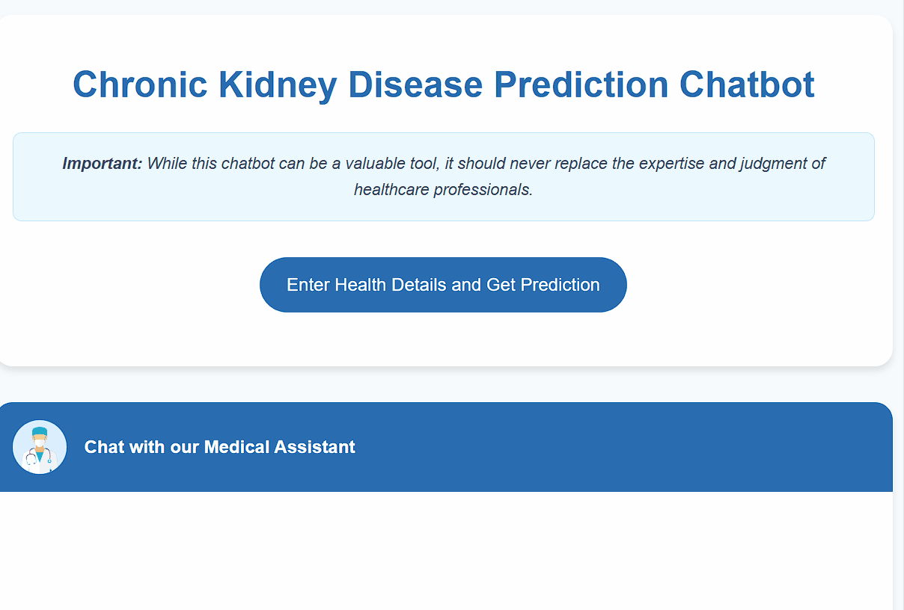

<div align="center">

# KidneyCareAI

### Intelligent Chronic Kidney Disease Risk Assessment & Medical Q&A Platform

*Combining Random Forest ML with Retrieval-Augmented Generation for evidence-based clinical decision support*

[](https://www.python.org/)
[](https://flask.palletsprojects.com/)
[](https://openai.com/)
[](https://www.pinecone.io/)
[](https://scikit-learn.org/)
[](https://www.docker.com/)
[](https://www.langchain.com/)
[](https://opensource.org/licenses/MIT)

**[Live Demo](https://chatbot-service-836178923173.europe-west2.run.app/) &nbsp;|&nbsp; [Report a Bug](https://github.com/Ezekwemdesmond/Chronic-Kidney-Disease-Chatbot/issues) &nbsp;|&nbsp; [Request a Feature](https://github.com/Ezekwemdesmond/Chronic-Kidney-Disease-Chatbot/issues)**

</div>

---

<div align="center">
  
</div>

---

## Table of Contents

- [Overview](#overview)
- [Key Features](#key-features)
- [System Architecture](#system-architecture)
- [Tech Stack](#tech-stack)
- [ML Model Performance](#ml-model-performance)
- [RAG Pipeline](#rag-pipeline)
- [Project Structure](#project-structure)
- [Quickstart](#quickstart)
  - [Docker (Recommended)](#option-1-docker-recommended)
  - [Local Setup](#option-2-local-setup)
- [Usage Guide](#usage-guide)
- [Dataset](#dataset)
- [Roadmap](#roadmap)
- [Contributing](#contributing)
- [Disclaimer](#disclaimer)
- [Acknowledgements](#acknowledgements)
- [Contact](#contact)

---

## Overview

**KidneyCareAI** is a production-grade, full-stack healthcare AI application that addresses the critical challenge of early Chronic Kidney Disease (CKD) detection. CKD affects over **850 million people worldwide** and is frequently undiagnosed until advanced stages — yet early identification can dramatically slow disease progression and reduce mortality.

This platform delivers two complementary capabilities in a single, unified interface:

1. **Risk Stratification** — A trained Random Forest classifier analyzes 15 clinical biomarkers to predict CKD likelihood with ~98% accuracy, providing immediate, personalized risk assessments.
2. **Evidence-Based Q&A** — A Retrieval-Augmented Generation (RAG) pipeline grounded in authoritative clinical literature (KDIGO guidelines, Brenner & Rector's Kidney textbook, ESPEN guidelines) powers a conversational assistant capable of answering nuanced medical questions.

The system is containerized with Docker, deployed on **Google Cloud Run**, and built with a clean modular architecture that cleanly separates ML inference, vector retrieval, LLM orchestration, and web serving concerns.

> **Medical Disclaimer:** This tool is intended for educational and informational purposes only. It does not constitute medical advice, diagnosis, or treatment. Always consult a qualified healthcare professional.

---

## Key Features

| Feature | Description |
|---|---|
| **CKD Risk Prediction** | Random Forest model trained on the UCI CKD dataset classifies risk using 15 clinical parameters |
| **Personalized Insights** | Prediction results are passed through the RAG pipeline to generate context-specific health guidance |
| **Medical Knowledge Base** | ~25MB of curated clinical PDFs indexed in Pinecone for semantic retrieval at query time |
| **Conversational AI** | GPT-powered chatbot with a defined `KidneyCareAI` persona, tuned for factual, grounded responses |
| **Source Transparency** | Every LLM response is tagged with `[SOURCES_USED]` or `[NO_SOURCES]` for traceability |
| **Real-Time Chat UX** | Typing indicators, timestamped messages, and smooth scroll for a polished chat experience |
| **Containerized Deployment** | Dockerfile with layer-optimized caching for fast, reproducible builds |
| **Cloud-Native** | Deployed on Google Cloud Run (Europe West 2) with serverless scaling |

---

## System Architecture

```
┌─────────────────────────────────────────────────────────────────────┐
│                          User Interface                             │
│          Chat Interface (index.html)  │  Health Form (form.html)   │
└────────────────────────┬────────────────────────┬───────────────────┘
                         │                        │
                         ▼                        ▼
┌─────────────────────────────────────────────────────────────────────┐
│                    Flask Application (app.py)                       │
│                      CKDChatbotCore Orchestrator                    │
│   POST /chat           │              POST /predict                 │
└────────────┬───────────┴──────────────────┬────────────────────────┘
             │                              │
             ▼                              ▼
┌────────────────────────┐    ┌─────────────────────────────────────┐
│    RAG Pipeline        │    │         ML Model Pipeline            │
│  (rag_pipeline.py)     │    │          (ml_model.py)               │
│                        │    │                                      │
│  ┌──────────────────┐  │    │  UCI CKD Dataset (398 records)       │
│  │  OpenAI GPT LLM  │  │    │  → KNN Imputation + Scaling          │
│  │  Temp: 0.4       │  │    │  → Label Encoding                    │
│  │  Max tokens: 500 │  │    │  → Random Forest (50 estimators)     │
│  └────────┬─────────┘  │    │  → ~98% Test Accuracy                │
│           │            │    └─────────────────┬───────────────────┘
│  ┌────────▼─────────┐  │                      │
│  │ LangChain Chain  │  │             Prediction + Advice
│  │ (RetrievalChain) │  │                      │
│  └────────┬─────────┘  │                      ▼
│           │            │         ┌─────────────────────────┐
│  ┌────────▼─────────┐  │         │    Result Page           │
│  │  Pinecone        │  │         │    (result.html)         │
│  │  Vector Store    │◄─┼─────────┤  Prediction + RAG Advice│
│  │  (384-dim cosine)│  │         └─────────────────────────┘
│  │  Top-k=3 chunks  │  │
│  └────────┬─────────┘  │
│           │            │
│  ┌────────▼─────────┐  │
│  │  Medical PDFs    │  │
│  │  (KDIGO, Brenner │  │
│  │  ESPEN, NIH)     │  │
│  │  all-MiniLM-L6-v2│  │
│  └──────────────────┘  │
└────────────────────────┘
```

### Design Patterns

- **Singleton Orchestrator** — `CKDChatbotCore` is instantiated once at startup and reused across all requests, eliminating costly model re-initialization
- **Modular Package Structure** — Business logic is fully isolated in `src/` with a clean public API via `__init__.py`
- **Embedding Cache** — Sentence transformer embeddings persisted to `embeddings.pkl`, eliminating HuggingFace Hub downloads on container restart
- **Separation of Concerns** — Flask routes contain zero business logic; all orchestration is delegated to typed, testable classes

---

## Tech Stack

### Core Infrastructure

| Layer | Technology | Purpose |
|---|---|---|
| Web Framework | Flask 3.0 | HTTP routing, request handling, template rendering |
| Containerization | Docker (Python 3.11-slim) | Reproducible builds, cloud deployment |
| Cloud Platform | Google Cloud Run | Serverless, auto-scaling deployment |

### Machine Learning

| Library | Version | Purpose |
|---|---|---|
| scikit-learn | 1.5.2 | Random Forest classifier, KNN imputation, preprocessing |
| pandas | 2.2.3 | Data ingestion, feature engineering |
| numpy | 1.26.4 | Numerical operations |
| joblib | 1.4.2 | Model artifact serialization / deserialization |

### AI & NLP

| Library | Version | Purpose |
|---|---|---|
| LangChain | 0.3.7+ | RAG chain orchestration, document loading, retrieval |
| OpenAI API | 1.54.5 | GPT LLM for response generation |
| Pinecone | 5.4.0 | Serverless vector database (AWS, cosine similarity) |
| sentence-transformers | 2.6.0 | `all-MiniLM-L6-v2` — 384-dim dense embeddings |
| PyPDF | 5.1.0 | Clinical PDF text extraction and chunking |

### Frontend

| Technology | Purpose |
|---|---|
| HTML5 / CSS3 | Responsive layouts, form design, results display |
| Vanilla JavaScript | Async fetch, typing indicators, real-time chat UX |

---

## ML Model Performance

The CKD classifier is trained on the **UCI Chronic Kidney Disease Dataset** (398 records, 24 original features) using a carefully engineered pipeline:

### Feature Engineering Pipeline

```
Raw Data (24 features)
        │
        ▼
Feature Selection (15 clinical biomarkers)
        │
        ▼
Missing Value Imputation (KNNImputer, k=5, with StandardScaler)
        │
        ▼
Categorical Encoding (LabelEncoder: yes/no, good/poor, normal/abnormal)
        │
        ▼
Random Forest Classifier
  • n_estimators  = 50
  • max_features  = "sqrt"
  • min_samples_split = 2
  • min_samples_leaf  = 1
  • random_state  = 42
        │
        ▼
~98% Test Accuracy
```

### Selected Clinical Features

| Category | Biomarkers |
|---|---|
| Blood Chemistry | Hemoglobin, Serum Creatinine, Blood Urea, Blood Glucose, Albumin, Sodium |
| Hematology | Red Blood Cell Count, Packed Cell Volume |
| Urine Analysis | Specific Gravity, Sugar |
| Vitals | Blood Pressure |
| Medical History | Hypertension, Diabetes Mellitus, Pedal Edema |
| Symptoms | Appetite |

---

## RAG Pipeline

The conversational assistant is powered by a LangChain-based RAG pipeline that grounds every response in curated, peer-reviewed clinical literature.

### Knowledge Base

| Document | Source | Content |
|---|---|---|
| KDIGO 2012 CKD Clinical Practice Guidelines | Kidney Disease: Improving Global Outcomes | Staging, diagnosis, management protocols |
| Brenner and Rector's The Kidney | Elsevier (Textbook) | Comprehensive nephrology reference |
| ESPEN Clinical Nutrition Guidelines | European Society for Clinical Nutrition | Dietary management for kidney disease |
| NIH Bookshelf — Kidney Disease Reference | National Library of Medicine | Patient-facing disease information |

### Pipeline Configuration

```
User Query
    │
    ▼
all-MiniLM-L6-v2 Encoder (384-dim)
    │
    ▼
Pinecone Serverless Index (cosine similarity)
  → Top-3 most relevant 500-character chunks
    │
    ▼
LangChain RetrievalChain
    │
    ▼
OpenAI GPT (temp=0.4, max_tokens=500)
  System Persona: "KidneyCareAI — friendly, knowledgeable medical assistant"
  • Grounds claims in retrieved documents
  • Tags responses with [SOURCES_USED] / [NO_SOURCES]
  • Distinguishes medical information from medical advice
    │
    ▼
Cleaned Response → User
```

---

## Project Structure

```
Chronic-Kidney-Disease-Chatbot/
│
├── app.py                          # Flask app entry point & CKDChatbotCore orchestrator
├── pyproject.toml                  # Project metadata & dependency declarations
├── requirements.txt                # Fully resolved dependency lockfile
├── Dockerfile                      # Container build instructions
├── embeddings.pkl                  # Cached sentence-transformer embeddings (91MB)
│
├── src/                            # Core business logic (modular package)
│   ├── __init__.py                 # Public API exports
│   ├── ml_model.py                 # Random Forest pipeline: train, impute, encode, predict
│   ├── document_processing.py      # PDF loading, text chunking, embedding generation
│   ├── vectorstore.py              # Pinecone index management & LangChain retriever
│   └── rag_pipeline.py             # LangChain RAG chain & OpenAI LLM integration
│
├── data/
│   ├── kidney_disease.csv          # UCI CKD dataset (398 records)
│   ├── kidney_disease_rf_model.pkl # Serialized Random Forest model artifact
│   ├── encoders.pkl                # Fitted categorical label encoders
│   ├── Bookshelf_NBK51773.pdf      # NIH kidney disease reference
│   ├── Brenner_and_Rectors_*.pdf   # Nephrology textbook (~18MB)
│   ├── ESPEN-guideline_*.pdf       # Clinical nutrition guidelines
│   └── KDIGO_2012_CKD_GL.pdf       # KDIGO clinical practice guidelines
│
├── templates/
│   ├── index.html                  # Chat interface
│   ├── form.html                   # 15-parameter clinical data entry form
│   └── result.html                 # Prediction result & personalized advice
│
└── static/
    ├── scripts/index.js            # Async chat, typing indicator, message rendering
    ├── styles/
    │   ├── index.css               # Chat UI styles
    │   ├── form.css                # Health form styles
    │   └── result.css              # Results page styles
    └── images/bot-icon.png         # KidneyCareAI avatar
```

---

## Quickstart

### Prerequisites

- Docker **or** Python 3.9+
- An [OpenAI API key](https://platform.openai.com/api-keys)
- A [Pinecone API key](https://www.pinecone.io/) (free tier is sufficient)

### Option 1: Docker (Recommended)

The fastest path to a running instance.

```bash
# 1. Clone the repository
git clone https://github.com/Ezekwemdesmond/Chronic-Kidney-Disease-Chatbot.git
cd Chronic-Kidney-Disease-Chatbot

# 2. Create your environment file
cat > .env << EOF
OPENAI_API_KEY=your_openai_api_key_here
PINECONE_API_KEY=your_pinecone_api_key_here
EOF

# 3. Build the Docker image
docker build -t ckd-chatbot .

# 4. Run the container
docker run -p 5000:5000 --env-file .env ckd-chatbot

# 5. Open http://localhost:5000 in your browser
```

### Option 2: Local Setup

```bash
# 1. Clone the repository
git clone https://github.com/Ezekwemdesmond/Chronic-Kidney-Disease-Chatbot.git
cd Chronic-Kidney-Disease-Chatbot

# 2. Create and activate a virtual environment
python -m venv venv
source venv/bin/activate        # macOS/Linux
# venv\Scripts\activate         # Windows

# 3. Install dependencies
pip install -r requirements.txt

# 4. Configure API keys
cat > .env << EOF
OPENAI_API_KEY=your_openai_api_key_here
PINECONE_API_KEY=your_pinecone_api_key_here
EOF

# 5. Start the application
python app.py

# 6. Open http://localhost:5000 in your browser
```

> **Note:** On first run, the application will connect to Pinecone and initialize the vector index. If the index is empty, ensure your documents are in the `data/` directory before running.

---

## Usage Guide

### Chat Interface

Navigate to the main page at `http://localhost:5000` to access the conversational assistant.

**Example queries:**
- *"What are the early symptoms of chronic kidney disease?"*
- *"How does diabetes affect kidney function?"*
- *"What dietary changes are recommended for CKD stage 3?"*
- *"Explain the KDIGO staging system for CKD."*

The assistant retrieves relevant passages from the medical knowledge base and synthesizes a grounded, factual response.

### CKD Risk Assessment

Click **"Check Your Risk"** to open the clinical data entry form. Enter values for the 15 biomarkers:

| Section | Parameters |
|---|---|
| Vital Signs | Blood Pressure, Packed Cell Volume |
| Blood Chemistry | Serum Creatinine, Blood Urea, Hemoglobin, RBC Count, Blood Glucose, Sodium, Albumin |
| Urine Analysis | Specific Gravity, Urinary Sugar |
| Medical History | Hypertension, Diabetes Mellitus, Pedal Edema |
| Lifestyle & Symptoms | Appetite |

Submit the form to receive:
1. A **CKD Risk Classification** (Likely / Unlikely)
2. **Personalized guidance** generated by the RAG pipeline, contextualized to the prediction result

---

## Dataset

This project uses the **UCI Chronic Kidney Disease Dataset**.

| Attribute | Detail |
|---|---|
| Source | [UCI Machine Learning Repository](https://archive.ics.uci.edu/dataset/336/chronic+kidney+disease) |
| Records | 398 patient records |
| Original Features | 24 (11 numeric, 13 categorical) |
| Features Used | 15 (selected by clinical relevance) |
| Class Balance | ~62% CKD, ~38% non-CKD |
| Missing Data | Handled via KNN imputation |

---

## Roadmap

- [ ] **SHAP Explainability** — Add feature importance visualizations to the results page so users understand which biomarkers drove the prediction
- [ ] **CKD Stage Prediction** — Extend the classifier from binary to multi-class (Stages 1–5 + ESRD)
- [ ] **Patient History** — Persist conversation and prediction history per session for longitudinal tracking
- [ ] **Authentication** — Add user accounts for secure, private health data management
- [ ] **Finer RAG Tuning** — Experiment with hybrid BM25 + dense retrieval and re-ranking for improved answer quality
- [ ] **CI/CD Pipeline** — GitHub Actions workflow for automated testing and Cloud Run deployment

---

## Contributing

Contributions are welcome. Please follow this workflow:

1. **Fork** the repository
2. **Create** a feature branch: `git checkout -b feature/your-feature-name`
3. **Commit** your changes: `git commit -m 'feat: add some feature'`
4. **Push** to your branch: `git push origin feature/your-feature-name`
5. **Open** a Pull Request with a clear description of the change and its motivation

Please ensure any new code is covered by tests and that existing tests pass before submitting.

---

## Disclaimer

KidneyCareAI is an **educational and research tool only**. It is not a substitute for professional medical advice, diagnosis, or treatment. The predictions and information provided by this application should never be used to make clinical decisions. Always seek the guidance of a qualified healthcare professional with any questions you may have regarding a medical condition.

---

## Acknowledgements

- **UCI Machine Learning Repository** — Chronic Kidney Disease dataset
- **KDIGO** — Clinical Practice Guideline for the Evaluation and Management of Chronic Kidney Disease (2012)
- **ESPEN** — Clinical Nutrition in Chronic Kidney Disease guidelines
- **LangChain** — RAG orchestration framework
- **Pinecone** — Serverless vector database infrastructure
- **OpenAI** — Large language model API

---

## Contact

**Desmond Ezekwem**

[](mailto:engrstephdez@gmail.com)
[](https://github.com/Ezekwemdesmond)

---

<div align="center">
  <sub>Built with care for the intersection of AI and clinical healthcare</sub>
</div>
